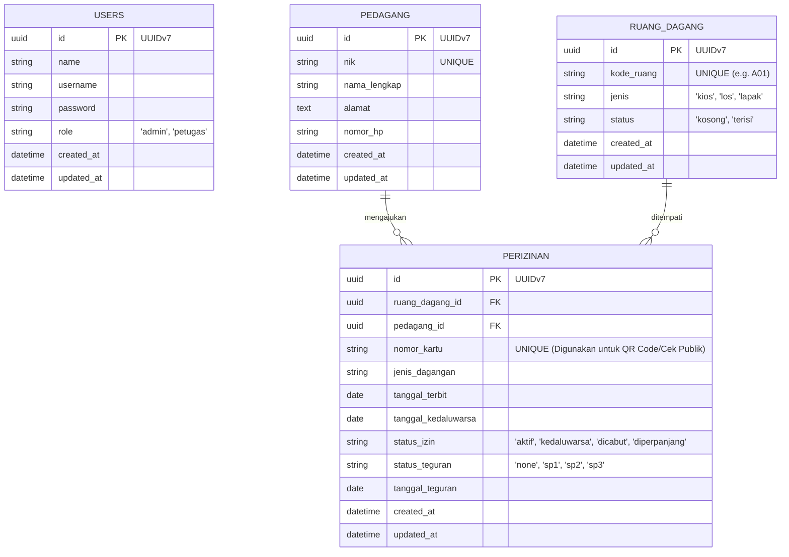

## Database Schema & ERD

Berdasarkan User Story (Issue #2) dan tambahan fitur Surat Peringatan (SP), berikut adalah rancangan skema database untuk SIMPASAR.

### Entity Relationship Diagram (ERD)

### Penjelasan Relasi & Keputusan Teknis
1. **Primary Key (UUIDv7)**: Menggunakan UUIDv7 (bukan Auto-Increment / BigInt) untuk semua entitas. UUIDv7 sangat ideal karena terurut berdasarkan waktu (*time-ordered*), menjaga performa *indexing* database, dan lebih aman dari *enumeration attack*.
2. **One-to-Many (`PEDAGANG` -> `PERIZINAN`)**: 1 Pedagang bisa menyewa banyak Ruang Dagang sekaligus (multi-petak) dan memiliki banyak riwayat. Tidak boleh ada duplikasi NIK di tabel `PEDAGANG`.
3. **One-to-Many (`RUANG_DAGANG` -> `PERIZINAN`)**: 1 Ruang Dagang memiliki banyak `PERIZINAN` karena history penyewa sebelumnya atau history perpanjangan izin tetap tersimpan.
4. **Pencarian Publik (QR Code)**: Kolom `nomor_kartu` pada tabel `PERIZINAN` adalah parameter unik (string *random* atau nomor register) yang digunakan saat Penghuni melakukan scan QR Code di halaman publik.
5. **Surat Peringatan (SP)**: Penambahan kolom `status_teguran` dan `tanggal_teguran` di tabel `PERIZINAN` untuk melacak riwayat SP berjenjang (SP1, SP2, SP3) jika penyewa menunggak.
